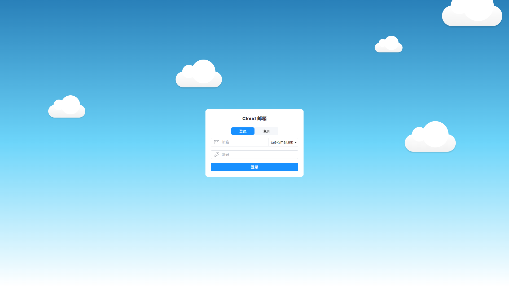
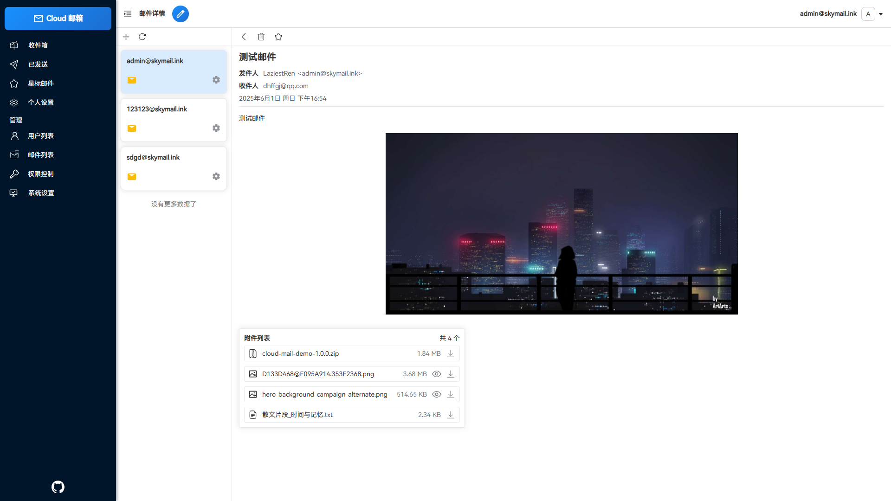
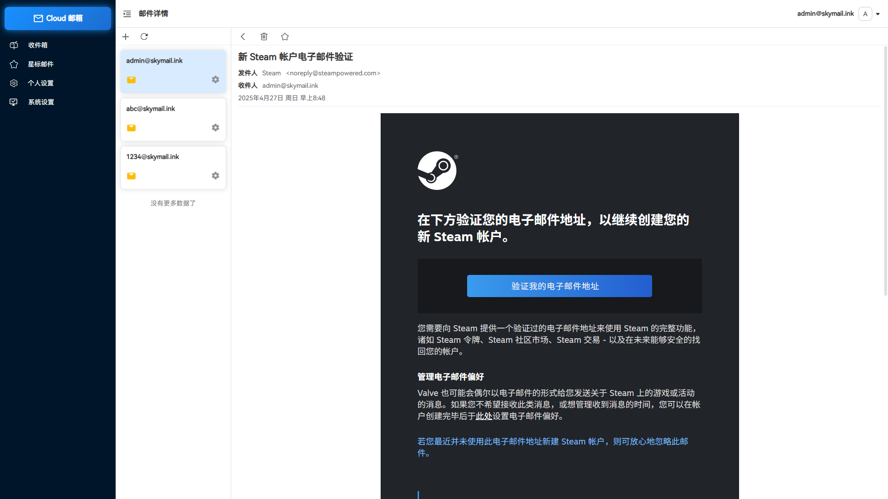
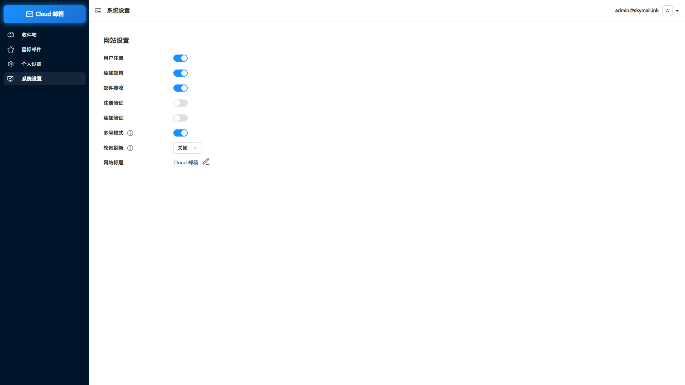

<p align="center">
  
</p>

<div align="center">
<h1>Cloud Mail</h1>
</div>
<div align="center">
    <h4>一个使用Vue3开发的响应式简约邮箱服务， 可以部署到Cloudflare云平台实现免费白嫖🎉</h4> 
</div>


## 在线演示

👉 https://skymail.ink

|  |  |
|--------------------------------------------------------|---------------------|
|  |  |


## 功能介绍

- **💰免费白嫖**：无需服务器，部署到Cloudflare Workers 免费使用，不要钱

- **💻响应式设计**：响应式布局自动适配PC和大部分手机端浏览器

- **🔀多号模式**：开启后一个用户可以添加多个邮箱，默认一用户一邮箱，类似各大邮箱平台

- **📦附件接收**：支持接收附件，使用R2对象存储保存和下载文件 

- **⭐星标邮件**：标记重要邮件，以便快速查阅

- **🎨个性化标题**：可以自定义网站标题

- **⏱️轮询刷新**：轮询请求服务器自动获取最新邮件，可自定义间隔

- **⚙️功能开关**：可以对注册，添加等功能关闭和开启，设为私人站点

- **🤖人机验证**：集成Turnstile人机验证，防止人机批量注册

- **📜更多功能**：正在开发中...


## 技术栈

- **框架**：[Vue3](https://vuejs.org/) + [Element Plus](https://element-plus.org/) 

- **Web框架**：[Hono](https://hono.dev/)

- **ORM：**[Drizzle](https://orm.drizzle.team/)

- **平台：** [Cloudflare workers](https://developers.cloudflare.com/workers/)

- **缓存**：[Cloudflare KV](https://developers.cloudflare.com/kv/)

- **数据库**：[Cloudflare D1](https://developers.cloudflare.com/d1/)

- **文件存储**：[Cloudflare R2](https://developers.cloudflare.com/r2/)


## 使用教程

[**👉小白保姆教程-界面部署**](https://doc.skymail.ink)

### 环境要求


Nodejs v18.20 +

Cloudflare 账号


**克隆项目到本地**
``` shell
git clone https://github.com/LaziestRen/cloud-mail #拉取代码
cd cloud-mail/mail-worker #进入worker目录
```

**安装依赖**
```shell
npm i
```

**项目配置**

```toml
[[d1_databases]]
binding = "db"			#d1数据库绑定名默认不可修改
database_name = ""		#d1数据库名字
database_id = ""		#d1数据库id

[[kv_namespaces]]
binding = "kv"			#kv绑定名默认不可修改
id = ""			        #kv数据库id

#(可选)
[[r2_buckets]]
binding = "r2"                  #r2对象存储绑定名默认不可修改
bucket_name = ""	        #r2对象存储桶的名字
	

[assets]
binding = "assets"		#静态资源绑定名默认不可修改
directory = "./dist"	        #前端vue项目打包的静态资源存放位置,默认dist

[vars]
domain = []			#邮件域名可以配置多个 示例: ["example1.com","example2.com"]
admin = ""		        #管理员的邮箱 示例: admin@example.com
jwt_secret = ""			#jwt令牌的密钥,随便填一串字符串
r2_domain = ""			#r2对象存储桶的访问域名(可选)
site_key = ""			#Turnstile人机验证的站点密钥(可选)
secret_key = ""			#Turnstile人机验证的后端密钥(可选)

```

**本地运行**

本地开发环境，数据库会自动安装，无需创建

```shell
npm run dev 
```


**远程部署**

在Cloudflare控制台创建KV和D1数据库，可选：R2对象存储，Turnstile人机验证 (这两个不配置附件和人机验证不可用)

在 wrangler.toml 中配置对应环境变量

```shell
npm run deploy 
```

然后进入域名管理->电子邮件->路由规则->Catch-all 地址. 这里选择发送到 worker, 然后选择创建的worker


## 目录结构

```
cloud-mail
├── mail-worker				#worker后端项目
│   ├── src                  
│   │   ├── api	 			#接口层			
│   │   ├── const  			#常量
│   │   ├── email			#邮件接收
│   │   ├── entity			#数据库实体层
│   │   ├── error			#自定义异常
│   │   ├── hono			#web框架配置 拦截器等
│   │   ├── init			#项目启动表创建 缓存初始化等
│   │   ├── model			#响应体数据封装
│   │   ├── security			#身份认证层
│   │   ├── service			#服务层
│   │   ├── utils			#工具类
│   │   └── index.js			#入口文件
│   ├── pageckge.json			#项目依赖
│   └── wrangler.toml			#项目配置
└── mail-vue				#vue前端项目
    ├── src
    │   ├── assets			#静态资源字体等
    │   ├── axios 			#axios配置
    │   ├── components			#自定义组件
    │   ├── day				#dayjs配置
    │   ├── layout			#主体布局组件
    │   ├── request			#api接口
    │   ├── router			#路由配置
    │   ├── store			#全局状态管理
    │   ├── utils			#工具类
    │   ├── views			#页面组件
    │   ├── app.vue			#根组件
    │   ├── main.js			#入口js
    │   └── style.css			#全局css
    ├── package.json			#项目依赖
    └── env.dev				#项目配置
```


## 许可证

本项目采用 [MIT](LICENSE) 许可证	


